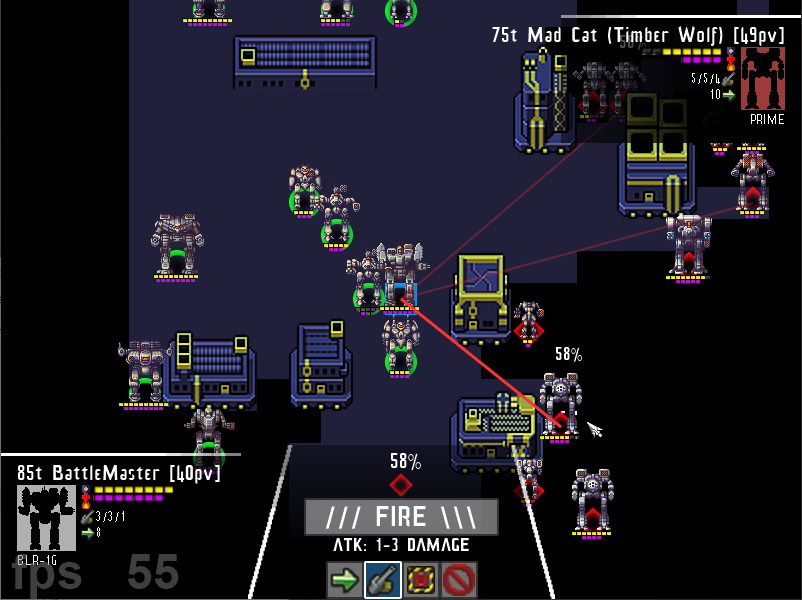

# PixelMek

PixelMek is an unofficial BattleTech strategy game using community contributed pixel mech artwork.

### Instructions for running from source:

1. Install [Python 2.7.x](https://www.python.org/downloads/release/python-2716/)
2. Install the required Python extensions from command line using pip:
    * pip install -r requirements.txt
3. Run from command line using python:
    * python pixelmek.py
    
    
### Instructions for creating executable from source:

1. Follow instructions used to run from source
2. Install cx_Freeze (http://cx-freeze.sourceforge.net/):
    * pip install cx_Freeze
3. Run from command line using python:
    * python dist_setup.py bdist_msi

### Game resources

The following art and sound resources used in this game are from various non-commercial sources:

* Pixel Mechs by Alistair Winter:
    * http://mwomercs.com/forums/topic/144488-x-mas-present-free-pixel-mechs/
    * http://mwomercs.com/forums/topic/184415-x-mas-2014-free-clan-pixel-mechs/
* Pixel Mechs by Luscious Dan:
    * http://mwomercs.com/forums/topic/231592-luscious-dans-pixel-mechs/
* Mouse Pointer:
    * http://opengameart.org/content/bw-ornamental-cursor-19x19
* Various OpenGameArt.org hosted sprite sheets:
    * http://opengameart.org/content/colony-sim-extended-version
    * http://opengameart.org/content/explosions-0
    * http://opengameart.org/content/sci-fi-space-simple-bullets
    * http://opengameart.org/content/2d-shooter-effects-alpha-version
    * http://opengameart.org/content/rpg-status-icons-16x16-and-8x8
    * http://opengameart.org/content/140-military-icons-set-fixed
* Pow Studios flash sprites:
    * http://powstudios.com/content/flash-animation-pack-1
* Sound effects:
    * Gauss: http://www.freesound.org/people/roper1911/sounds/155790/
    * Laser: http://www.freesound.org/people/Nakhas/sounds/344813/
    * Cannon: http://www.freesound.org/people/Andromadax24/sounds/169775/
    * PPC: http://www.freesound.org/people/soundmatch24/sounds/194312/
    * Machine Gun: http://www.freesound.org/people/burkay/sounds/130123/
    * Flamer: http://www.freesound.org/people/Vosvoy/sounds/123632/
    * Missiles: http://www.freesound.org/people/Audionautics/sounds/171655/
    * Explosion: http://www.freesound.org/people/klankbeeld/sounds/344686/
    * Multiple Explosions: http://www.freesound.org/people/CLaforet/sounds/351963/
    * Stompy Mech: http://www.freesound.org/people/nabz871/sounds/324450/
* Fonts:
    * Convoy: http://www.1001freefonts.com/convoy.font
    * Transcends Games: https://fontlibrary.org/en/font/transcends-games
